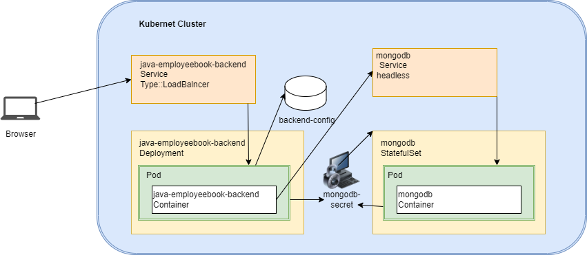

# EmployeeBook Backend Deployment with Horizontal Pod Autoscaler

This repository contains Kubernetes configurations for deploying the EmployeeBook backend application, along with a horizontal pod autoscaler that scales the deployment based on CPU and memory utilization. Additionally, it includes configurations for setting up MongoDB with a secret, StatefulSet, and headless service.

## Table of Contents

- [Overview](#overview)
- [MongoDB Secret](#mongodb-secret)
- [MongoDB StatefulSet](#mongodb-statefulset)
- [MongoDB Headless Service](#mongodb-headless-service)
- [Deployment](#deployment)
- [Service](#service)
- [Horizontal Pod Autoscaler](#horizontal-pod-autoscaler)
- [Java Controller](#java-controller)
- [How to Run](#how-to-run)

## Overview

This project includes the following components:
- Architecture diagram
- A Secret to manage MongoDB credentials.
- A StatefulSet to manage MongoDB.
- A headless Service to enable communication with MongoDB StatefulSet.
- A Kubernetes Deployment for the backend application.
- A Service to expose the backend application.
- A Horizontal Pod Autoscaler to scale the deployment based on CPU and memory utilization.
- A Java Spring Boot application with an endpoint to increase memory usage.

## Architecture diagram



## MongoDB Secret

The `Secret` object stores MongoDB credentials securely. These credentials are referenced in the MongoDB StatefulSet and the backend Deployment.

## MongoDB StatefulSet

The `StatefulSet` object manages the deployment and scaling of MongoDB pods. It ensures the pods are deployed in a specific order and maintains a stable network identity for each pod.

## MongoDB Headless Service

The headless `Service` allows the MongoDB StatefulSet to be discoverable within the Kubernetes cluster without creating a load balancer.

## Deployment

The `Deployment` object defines the EmployeeBook backend application deployment. It includes an initialization container to wait for MongoDB to be ready before starting the backend container. The deployment uses a rolling update strategy to ensure zero downtime during updates.

## Service

The `Service` object exposes the backend application via a LoadBalancer, making it accessible outside the Kubernetes cluster.

## Horizontal Pod Autoscaler

The `HorizontalPodAutoscaler` object scales the backend deployment based on CPU and memory utilization. It monitors the average utilization of CPU and memory and adjusts the number of replicas within the specified range (1 to 3 replicas).

## Java Controller

The Java application includes a Spring Boot controller to stress cpu/memory for testing the autoscaler. The controller has an endpoint that, when accessed, performs operations that increase cpu/memory usage and keep the CPU busy for a specified duration.

## How to Run

1. **Create the MongoDB secret**: Apply the secret YAML file.
    ```sh
    kubectl apply -f kube-assign/mongodb-kubernets-manifest/mongodb-secret.yaml 
    ```

2. **Deploy the MongoDB StatefulSet**: Apply the statefulset YAML file.
    ```sh
    kubectl apply -f kube-assign/mongodb-kubernets-manifest/mongodb-statuefulset.yaml
    ```

3. **Expose MongoDB with a headless service**: Apply the service YAML file.
    ```sh
    kubectl apply -f kube-assign/mongodb-kubernets-manifest/mongodb-headless-svc.yaml
    ```

4. **Create ConfigMap**: Apply the config map YAML file.
    ```sh
     kubectl apply -f kube-assign/backend-V1/employee-backend-kubernetes-manifests/employee-configmap.yaml
    ```

5. **Deploy the backend application**: Apply the deployment YAML file.
    ```sh
    kubectl apply -f kube-assign/backend-V1/employee-backend-kubernetes-manifests/employee-backend.deployment.yaml
    ```

6. **Expose the backend application**: Apply the service YAML file.
    ```sh
    kubectl apply -f kube-assign/backend-V1/employee-backend-kubernetes-manifests/employee-backend.service.yaml
    ```

7. **Set up the autoscaler**: Apply the autoscaler YAML file.
    ```sh
     kubectl apply -f kube-assign/backend-V1/employee-backend-kubernetes-manifests/employee-horizontalAutoScaler.yaml 
    ```

8. **MongoDB Command**: Set up user
    ```sh
    kubectl run -it mongo-shell --image=mongo:4 --rm  -- /bin/bash
    mongo mongodb-0.mongodb  -u "mongoadmin" -p password123 --authenticationDatabase "admin"
    use employeeBook;
    db.createUser(
    {
    user: "mongoadmin",
    pwd: "password123",
    roles: [ { role: "readWrite", db: "employeebook" } ]
      }
    )
    
    
    db.employee.find();
    ```

9. **Rolling Update v2**:
    ```sh
    kubectl apply -f kube-assign/backend-V2/employee-backend-kubernetes-manifests/employee-backend-v2.deployment.yaml
    ```
    

By following these steps, you can set up MongoDB, deploy the EmployeeBook backend application, expose it, and set up a horizontal pod autoscaler to manage scaling based on CPU and memory utilization metrics.

# Source Code for the project. 
https://github.com/gandhipratik65/kube-assign/tree/master

# All Kubernetes YAML files used in the assignment.
https://github.com/gandhipratik65/kube-assign/tree/master/mongodb-kubernets-manifest
https://github.com/gandhipratik65/kube-assign/tree/master/backend-V1/employee-backend-kubernetes-manifests
https://github.com/gandhipratik65/kube-assign/tree/master/backend-V2/employee-backend-kubernetes-manifests

# Dockerfile 
https://github.com/gandhipratik65/kube-assign/blob/master/backend-V1/Dockerfile
https://github.com/gandhipratik65/kube-assign/blob/master/backend-V2/Dockerfile

## Docker image endpoint

https://hub.docker.com/repository/docker/gandhipratik65/backend/tags

https://hub.docker.com/layers/gandhipratik65/backend/v1/images/sha256-182bed0f7e3ebbff58c3082282fba9672b08c8431c87f358c6c649b3c4d5ba13?context=repo

https://hub.docker.com/layers/gandhipratik65/backend/v2/images/sha256-aa7b9a98f79c63c8f87dd98ca1e82935f3d5e53d52772f5d3edb103a4fece3ac?context=repo

